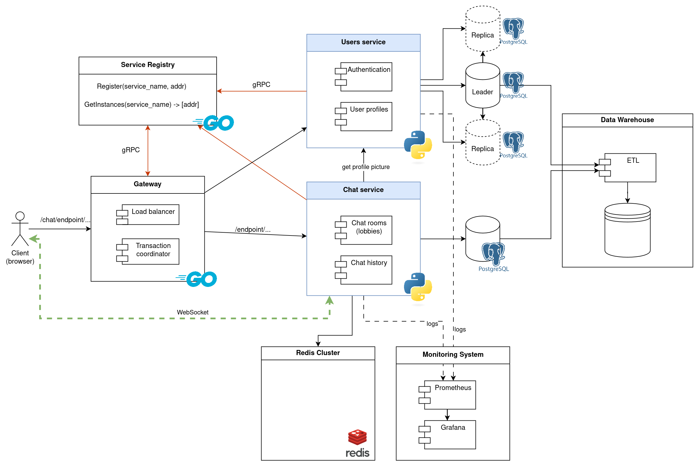

# Messaging app built with microservices

This project implements a basic messaging app like IRC using a bunch of techniques and technologies:
- Microservices
- API Gateway with load balancing
- Service discovery
- Caching
- Docker
- Websockets

# Screenshots

Dashboard using Grafana, with Prometheus collecting metrics:


# Usage

Run:
```sh
docker compose up
```

# Development

During development, we want to rebuild the images in case some code changed (using `--build`)
and turn on watch mode for the services that support it (using `--watch`):
```sh
docker compose up --build --watch
```


# Documentation

## Application Suitability Assessment

The question is whether it would be a good idea to use microservices for the messaging app I'm building.

One way to look at it is that I'm simply extracting all the functionality related to users and authentication into a service (called `users`,
while keeping all the main functionality in a separate service (called `chat`).
The chat service uses websockets to receive and send messages to users.

A very similar approach is used by  [lichess.com](https://github.com/lichess-org/lila), although for chess instead of chats:
Lichess dedicates one service to handle the WebSocket connections for live games
and uses another service to store the user and replay files.
This way, the live games service can be scaled on multiple machines,
while a single data service may suffice.
Thus, the same approach for service boundaries should work well for my chat app.


## Service boundaries



The **Users service** should handle mainly everything related to authentication,
such as registration, login and whatnot.
It can also store user data, such as profile pictures and other information.
This service should not be worried about messages in any way.

The **Chat service** should handle all the logic of a messaging app: chat rooms (lobbies) and websockets.

## Technology Stack and Communication Patterns

The APIs will accept HTTP requests with JSON bodies (mis-termed REST).

- Users service: Python + Postgres
- Chat service: Python + Postgres
- Gateway: Go
- Service Discovery: Go

## API Interfaces

### Users service

```
POST /register (username, password)
POST /login (username, password) -> token
GET /verify (token) -> boolean
POST /logout (token)
```

### Chat service

```
POST /room (username, password) -> websocket
```

The websocket is created for a specific chat room,
and is used to send messages back and forth, like this:
```
< FROM <user_id> <message>
> SEND <message>
```

### Gateway

The gateway proxies requests of the form `/chat/...` to a chat service instance,
and those of the form `/users/...` to a users service instance.

An exception is the request `DELETE /users/<user_id>` 
which will create a transaction with two parts:
1. Delete all private chat rooms containing the user being deleted
2. Delete the user

## Deployment & Scaling

All services, including Gateway, Service discovery, databases and Prometheus + Grafana 
run inside Docker containers and are managed with Docker Compose.


